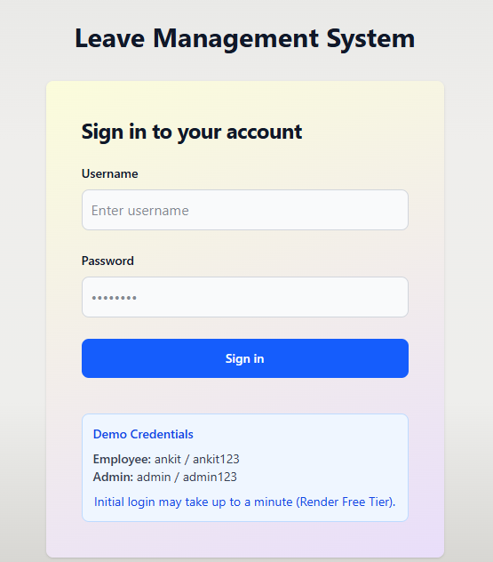
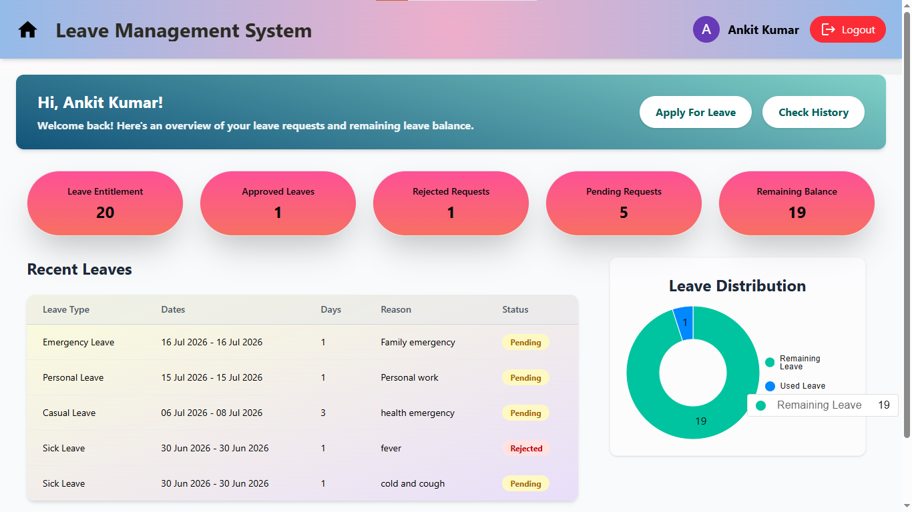
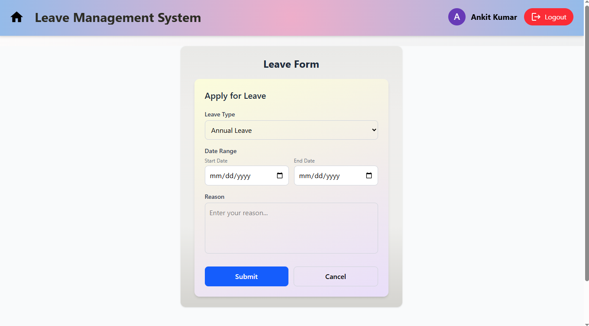
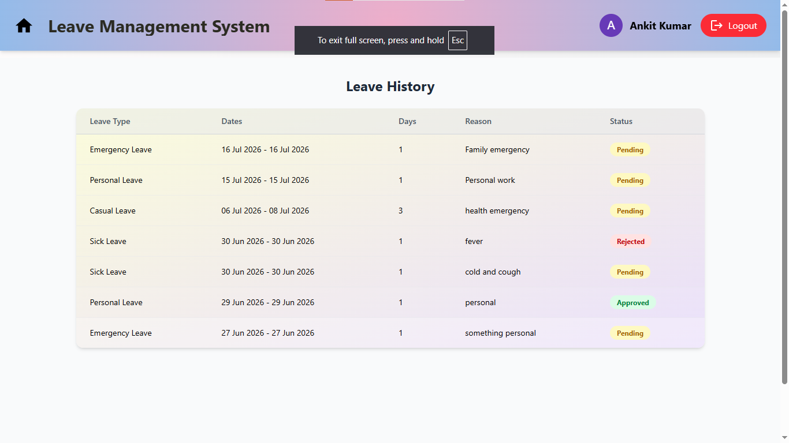
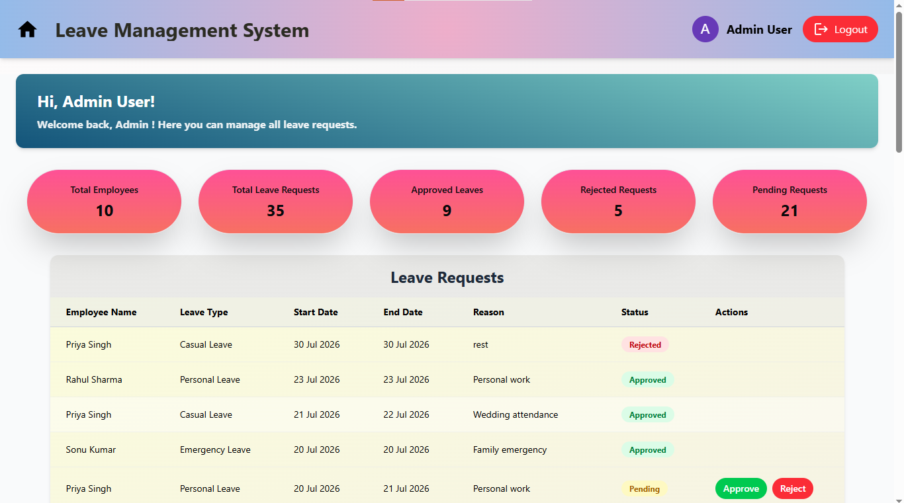

# Leave Management System (LMS)

A full-stack Leave Management System built using the MERN stack. The application enables employees to apply for leave, track leave history, and manage leave balances, while administrators can review, approve, or reject leave requests through a dedicated dashboard.

> **Note:** The application is hosted on Render's free tier, so the initial login may take up to a minute while the server wakes up.

---

## 🚀 Live Demo

🔗 **Frontend:** https://leave-management-system-tan.vercel.app/

---

## 📌 Features

### Employee
- Secure Login Authentication
- Dashboard with leave statistics
- Apply for leave
- View leave history
- Track leave status (Pending, Approved, Rejected)
- Leave balance tracking

### Admin
- Admin Dashboard
- View all leave requests
- Approve or reject leave requests
- Automatic leave balance update
- Employee leave management

---

## 🛠️ Tech Stack

### Frontend
- React.js
- Tailwind CSS
- React Router
- Axios

### Backend
- Node.js
- Express.js

### Database
- MongoDB
- Mongoose

### Authentication
- bcrypt

### Deployment
- Render
- Vercel

---

## 📂 Project Structure

```
Leave Management System/
│
├── BACKEND/
│   ├── controllers/
│   ├── models/
│   ├── routes/
│   ├── app.js
│   ├── config.js
│   └── package.json
│
├── FRONTEND/
│   ├── public/
│   ├── src/
│   ├── index.html
│   ├── vite.config.js
│   ├── vercel.json
│   └── package.json
│
└── README.md
```

---

## ⚙️ Installation

### Clone the repository

```bash
git clone https://github.com/abhinavbhardwaj001/leave-management-system.git
```

### Install Frontend

```bash
cd FRONTEND
npm install
```

### Install Backend

```bash
cd ../BACKEND
npm install
```

---

## 🔑 Environment Variables

Create a `.env` file inside the `BACKEND` folder.

```env
PORT=5000

MONGODB_URI=your_mongodb_connection_string

```

---

## ▶️ Run the Project

### Start Backend

```bash
cd BACKEND
npm run dev
```

### Start Frontend

```bash
cd FRONTEND
npm run dev
```

---

## 📸 Screenshots

### Login Page


### Employee Dashboard


### Apply Leave


### Leave History


### Admin Dashboard


---

## 🎯 Future Improvements

- Email notifications
- Leave cancellation
- Calendar integration
- Search and filter leave requests
- Employee profile management
- Dark mode
- Analytics dashboard

---

## 👨‍💻 Author

**Abhinav Bhardwaj**

- GitHub: https://github.com/abhinavbhardwaj001
- LinkedIn: https://linkedin.com/in/abhinav-bhardwaj-23ab4b340

---

## 📄 License

This project is developed for learning and portfolio purposes.